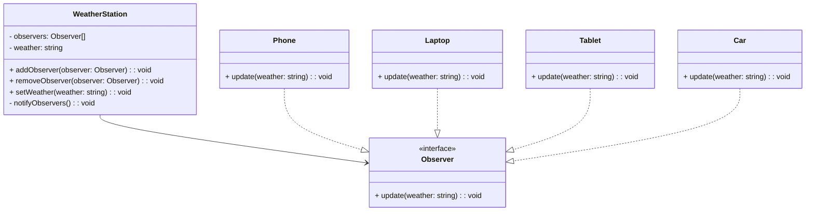

# UML - Exercice 2 - Observer 

```mermaid
classDiagram

class Observer {
    <<interface>>
    + update(weather: string): void
}

class WeatherStation {
    - observers: Observer[]
    - weather: string
    + addObserver(observer: Observer): void
    + removeObserver(observer: Observer): void
    + setWeather(weather: string): void
    - notifyObservers(): void
}

class Phone {
    + update(weather: string): void
}

class Laptop {
    + update(weather: string): void
}

class Tablet {
    + update(weather: string): void
}

class Car {
    + update(weather: string): void
}

WeatherStation --> Observer
Phone ..|> Observer
Laptop ..|> Observer
Tablet ..|> Observer
Car ..|> Observer
```