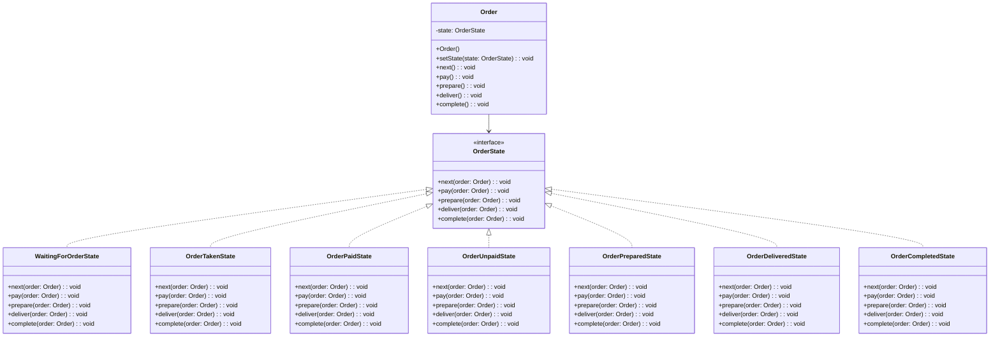

# UML - Exercice 3 - State

```mermaid
classDiagram
    class OrderState {
      <<interface>>
      +next(order: Order): void
      +pay(order: Order): void
      +prepare(order: Order): void
      +deliver(order: Order): void
      +complete(order: Order): void
    }
    
    class WaitingForOrderState {
      +next(order: Order): void
      +pay(order: Order): void
      +prepare(order: Order): void
      +deliver(order: Order): void
      +complete(order: Order): void
    }

        class OrderTakenState {
      +next(order: Order): void
      +pay(order: Order): void
      +prepare(order: Order): void
      +deliver(order: Order): void
      +complete(order: Order): void
    }

        class OrderPaidState {
      +next(order: Order): void
      +pay(order: Order): void
      +prepare(order: Order): void
      +deliver(order: Order): void
      +complete(order: Order): void
    }

        class OrderUnpaidState {
      +next(order: Order): void
      +pay(order: Order): void
      +prepare(order: Order): void
      +deliver(order: Order): void
      +complete(order: Order): void
    }

        class OrderPreparedState {
      +next(order: Order): void
      +pay(order: Order): void
      +prepare(order: Order): void
      +deliver(order: Order): void
      +complete(order: Order): void
    }

        class OrderDeliveredState {
      +next(order: Order): void
      +pay(order: Order): void
      +prepare(order: Order): void
      +deliver(order: Order): void
      +complete(order: Order): void
    }

        class OrderCompletedState {
      +next(order: Order): void
      +pay(order: Order): void
      +prepare(order: Order): void
      +deliver(order: Order): void
      +complete(order: Order): void
    }

        class Order {
      -state: OrderState
      +Order()
      +setState(state: OrderState): void
      +next(): void
      +pay(): void
      +prepare(): void
      +deliver(): void
      +complete(): void
    }

    OrderState <|.. WaitingForOrderState
    OrderState <|.. OrderTakenState
    OrderState <|.. OrderPaidState
    OrderState <|.. OrderUnpaidState
    OrderState <|.. OrderPreparedState
    OrderState <|.. OrderDeliveredState
    OrderState <|.. OrderCompletedState

    Order --> OrderState
```