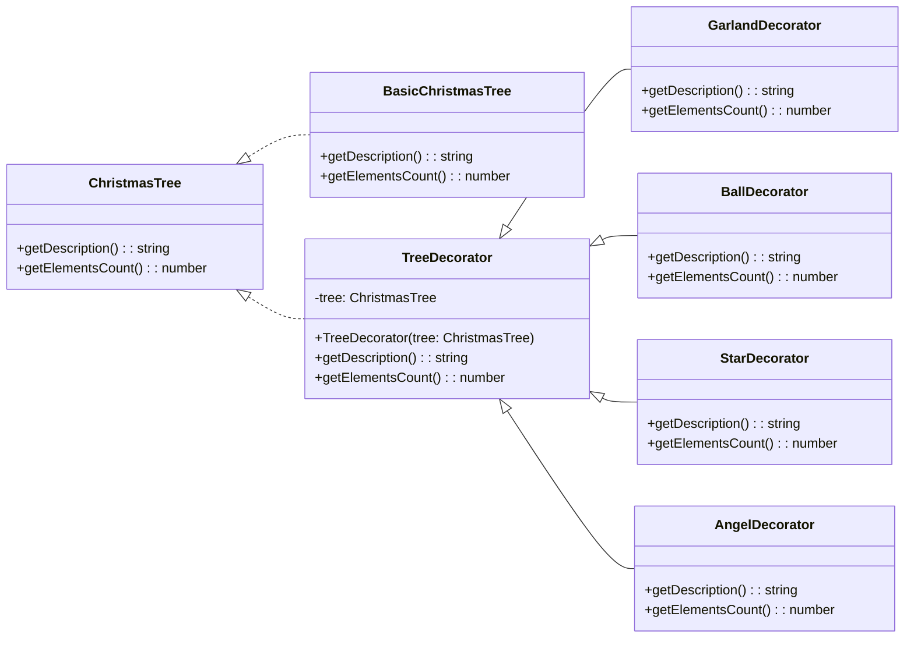

# UML - Exercice 4 - Decorator

```mermaid
classDiagram
    direction LR
    class ChristmasTree {
        +getDescription(): string
        +getElementsCount(): number
    }

    class BasicChristmasTree {
        +getDescription(): string
        +getElementsCount(): number
    }

    class TreeDecorator {
        -tree: ChristmasTree
        +TreeDecorator(tree: ChristmasTree)
        +getDescription(): string
        +getElementsCount(): number
    }

    class GarlandDecorator {
        +getDescription(): string
        +getElementsCount(): number
    }

    class BallDecorator {
        +getDescription(): string
        +getElementsCount(): number
    }

    class StarDecorator {
        +getDescription(): string
        +getElementsCount(): number
    }

    class AngelDecorator {
        +getDescription(): string
        +getElementsCount(): number
    }

    ChristmasTree <|.. BasicChristmasTree
    ChristmasTree <|.. TreeDecorator
    TreeDecorator <|-- GarlandDecorator
    TreeDecorator <|-- BallDecorator
    TreeDecorator <|-- StarDecorator
    TreeDecorator <|-- AngelDecorator
```