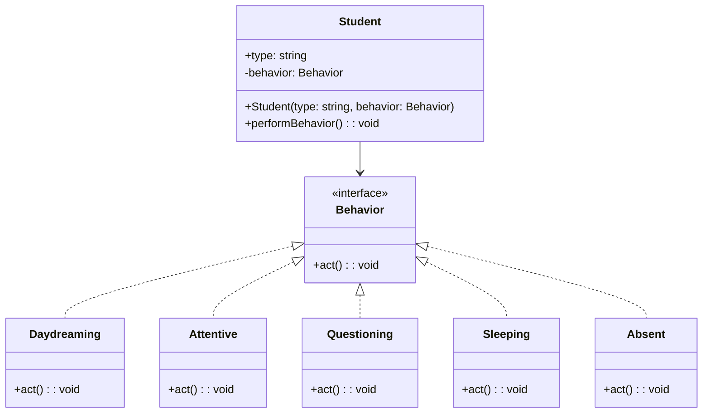

# UML - Exercice 5 - Strategy

```mermaid
classDiagram
    class Behavior {
        <<interface>>
        +act(): void
    }

        class Daydreaming {
        +act(): void
    }

        class Attentive {
        +act(): void
    }

        class Questioning {
        +act(): void
    }

        class Sleeping {
        +act(): void
    }

        class Absent {
        +act(): void
    }

        class Student {
        +type: string
        -behavior: Behavior
        +Student(type: string, behavior: Behavior)
        +performBehavior(): void
    }

    Behavior <|.. Daydreaming
    Behavior <|.. Attentive
    Behavior <|.. Questioning
    Behavior <|.. Sleeping
    Behavior <|.. Absent
    Student --> Behavior
```