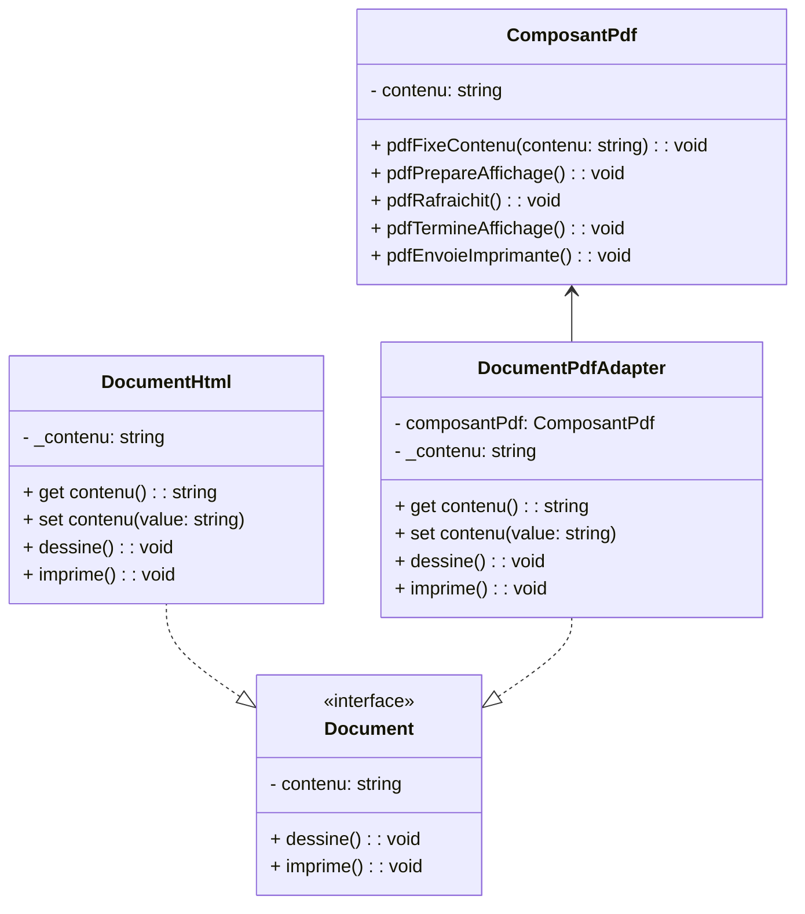

# UML - Exercice 6 - Adapter

```mermaid
classDiagram
    direction BT
    class Document {
        <<interface>>
        - contenu: string
        + dessine(): void
        + imprime(): void
    }

    class DocumentHtml {
        - _contenu: string
        + get contenu(): string
        + set contenu(value: string)
        + dessine(): void
        + imprime(): void
    }

    class ComposantPdf {
        - contenu: string
        + pdfFixeContenu(contenu: string): void
        + pdfPrepareAffichage(): void
        + pdfRafraichit(): void
        + pdfTermineAffichage(): void
        + pdfEnvoieImprimante(): void
    }

    class DocumentPdfAdapter {
        - composantPdf: ComposantPdf
        - _contenu: string
        + get contenu(): string
        + set contenu(value: string)
        + dessine(): void
        + imprime(): void
    }

    Document <|.. DocumentHtml
    Document <|.. DocumentPdfAdapter
    DocumentPdfAdapter --> ComposantPdf
```