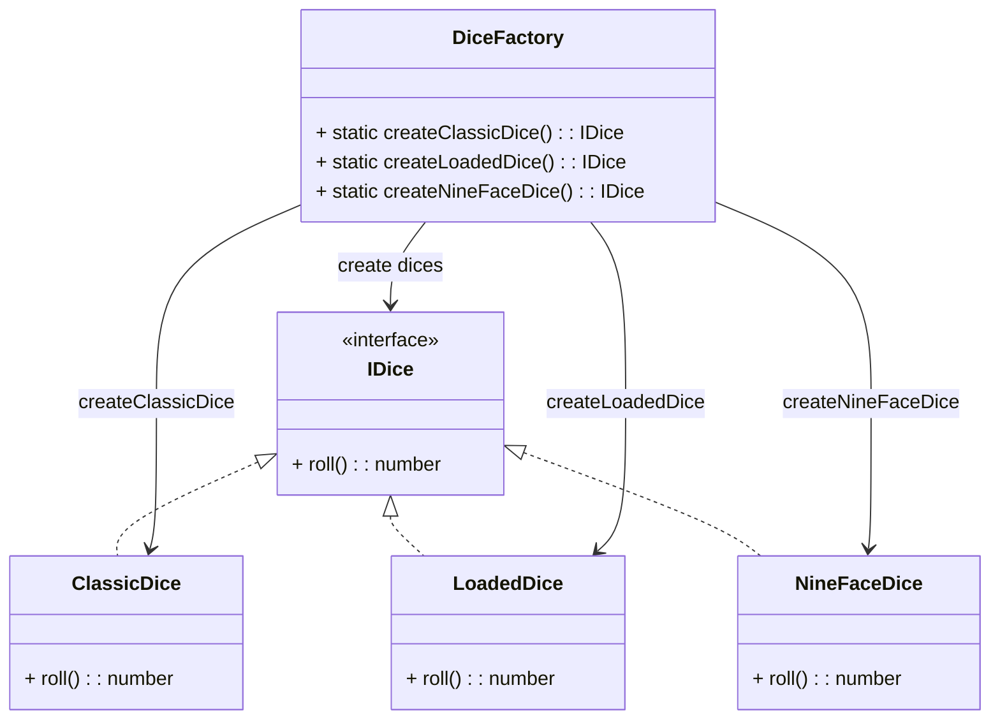

# UML - Exercice 7 - Factory

```mermaid
classDiagram
    IDice <|.. ClassicDice
    IDice <|.. LoadedDice
    IDice <|.. NineFaceDice

    class IDice {
      <<interface>>
      + roll(): number
    }

    class ClassicDice {
      + roll(): number
    }

    class LoadedDice {
      + roll(): number
    }

    class NineFaceDice {
      + roll(): number
    }

    class DiceFactory {
      + static createClassicDice(): IDice
      + static createLoadedDice(): IDice
      + static createNineFaceDice(): IDice
    }

    DiceFactory --> IDice : create dices
    DiceFactory --> ClassicDice : createClassicDice
    DiceFactory --> LoadedDice : createLoadedDice
    DiceFactory --> NineFaceDice : createNineFaceDice
```